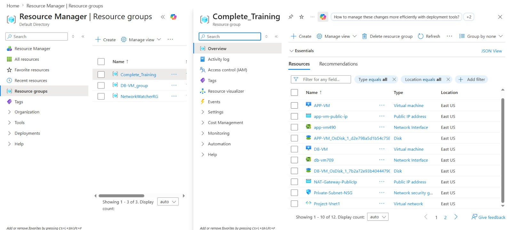
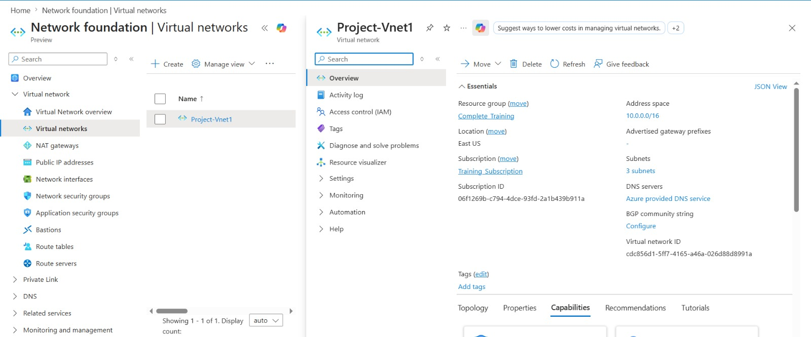
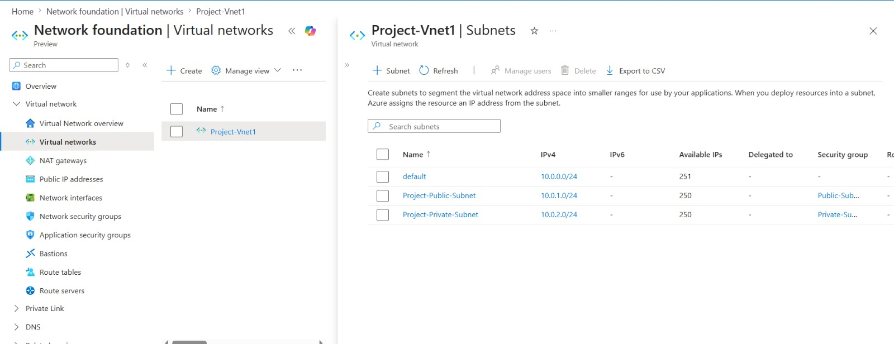
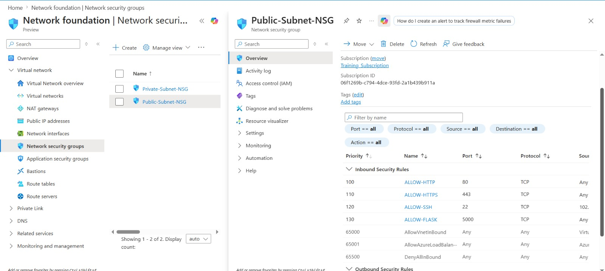
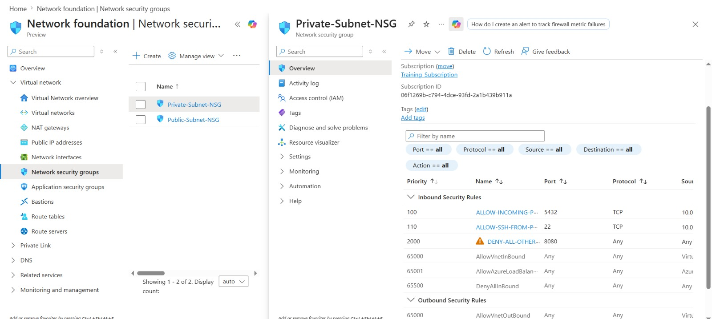
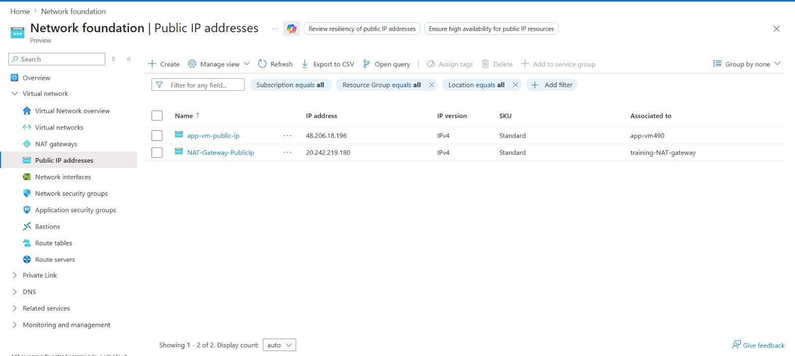
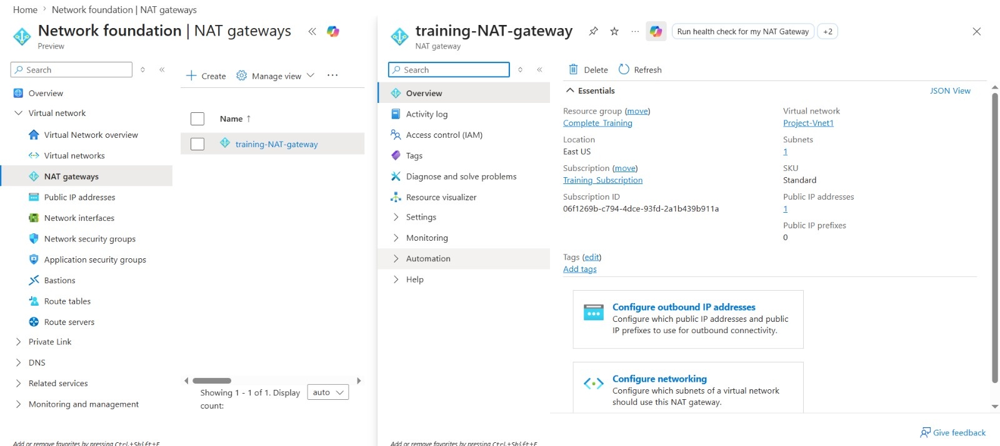
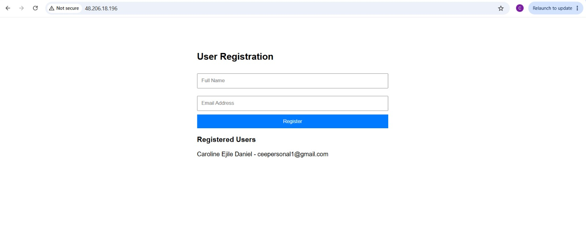
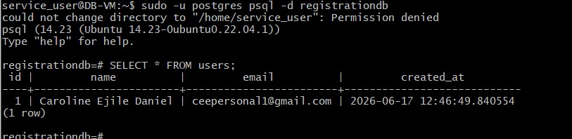

# azure-secure-vpc-webapp

### Screenshots

**Resource Group — All project resources in one place**

**Virtual Network Configuration**

**Subnet Overview**

**Public Subnet Configuration**

**Private Subnet Configuration**

**Public IP Address**

**NAT Gateway — Enabling outbound internet for private subnet**

**Registration App — Accessible from the internet**

**Database Records — Confirming end to end communication**

## Overview

A production-style cloud infrastructure project built on Microsoft 
Azure. A user registration web application is deployed across a secure 
Virtual Network with public and private subnet separation — following 
real-world network security principles used in enterprise environments.

The frontend application sits in a public subnet and communicates 
with a PostgreSQL database in a private subnet. Network Security Groups 
enforce strict traffic rules between layers ensuring the database is 
never directly exposed to the internet.

## Architecture
Internet
↓
Public IP Address
↓
┌─────────────────────────────────────────────┐
│           Azure Virtual Network              │
│              (10.0.0.0/16)                  │
│                                              │
│  ┌────────────────────────────────────────┐ │
│  │     Public Subnet (10.0.1.0/24)        │ │
│  │     NSG: Allow HTTP/HTTPS from Any     │ │
│  │     NSG: Allow SSH from My IP only     │ │
│  │                                        │ │
│  │   ┌──────────────────────────────┐    │ │
│  │   │           App VM             │    │ │
│  │   │   Nginx + Flask + Gunicorn   │    │ │
│  │   └──────────────────────────────┘    │ │
│  └──────────────────┬─────────────────────┘ │
│                     │ Port 5432 only         │
│                     │ from 10.0.1.0/24       │
│  ┌──────────────────▼─────────────────────┐ │
│  │     Private Subnet (10.0.2.0/24)       │ │
│  │     NSG: Allow 5432 from public only   │ │
│  │     NSG: Deny all other inbound        │ │
│  │                                        │ │
│  │   ┌──────────────────────────────┐    │ │
│  │   │           DB VM              │    │ │
│  │   │       PostgreSQL 14          │    │ │
│  │   └──────────────────────────────┘    │ │
│  └────────────────────────────────────────┘ │
│                                              │
│  NAT Gateway → Outbound internet for DB VM  │
└─────────────────────────────────────────────┘

---

## Infrastructure Components

| Resource | Name | Purpose |
|---|---|---|
| Resource Group | devops-project-rg | Container for all resources |
| Virtual Network | devops-vnet | Private network 10.0.0.0/16 |
| Public Subnet | public-subnet | Hosts app VM 10.0.1.0/24 |
| Private Subnet | private-subnet | Hosts DB VM 10.0.2.0/24 |
| NSG | public-subnet-nsg | Firewall rules for app VM |
| NSG | private-subnet-nsg | Firewall rules for DB VM |
| NAT Gateway | devops-nat-gateway | Outbound internet for private subnet |
| App VM | APP-VM | Ubuntu 22.04 Standard_B1s |
| DB VM | DB-VM | Ubuntu 22.04 Standard_B1s |

---

## Security Design

This project follows the **principle of least privilege** — 
every resource only permits the minimum traffic required 
to function correctly.

### Public Subnet NSG
| Rule | Port | Source | Action |
|---|---|---|---|
| Allow-HTTP | 80 | Any | Allow |
| Allow-HTTPS | 443 | Any | Allow |
| Allow-SSH | 22 | My IP only | Allow |

### Private Subnet NSG
| Rule | Port | Source | Action |
|---|---|---|---|
| Allow-PostgreSQL | 5432 | 10.0.1.0/24 only | Allow |
| Allow-SSH | 22 | 10.0.1.0/24 only | Allow |
| Deny-All-Inbound | * | Any | Deny |

**Key security decisions:**
- DB VM has no public IP — completely hidden from internet
- Database port 5432 only accepts connections from public subnet
- SSH to DB VM only possible through app VM — jump host pattern
- NAT Gateway provides outbound internet for private subnet 
  without exposing it to inbound connections

---

## Application Stack

### App VM — Public Subnet
| Component | Purpose |
|---|---|
| Nginx | Reverse proxy — handles all port 80 traffic |
| Gunicorn | WSGI server — runs Flask with multiple workers | (WSGI serves as an interpreter between Nginx and Flask)
| Flask | Web framework — handles form logic and DB connection |
| Systemd | Keeps Flask app running permanently as a service |

### DB VM — Private Subnet
| Component | Purpose |
|---|---|
| PostgreSQL 14 | Stores user registrations |
| pg_hba.conf | Configured to accept connections from app subnet only |
(postgres host based authentication config-file)

## The Application

A user registration form demonstrating full-stack communication 
across network boundaries:
User visits public IP in browser
↓
Nginx receives request on port 80
↓
Nginx forwards to Flask on port 5000
↓
Flask renders registration form
↓
User submits name and email
↓
Flask connects to PostgreSQL on private subnet (10.0.2.4:5432)
↓
Data saved to registrationdb database
↓
Page confirms successful registration

## Challenges Encountered and How I Solved Them

### Challenge 1 — Private VM Had No Internet Access
**Problem:** Running `apt install postgresql` on the DB VM 
failed with connection timeout errors to azure.archive.ubuntu.com

**Root cause:** Private subnet VMs have no route to the 
internet by design. That is the point of a private subnet — 
nothing gets in or out without explicit configuration.

**Solution:** Created an Azure NAT Gateway attached to the 
private subnet. NAT Gateway allows outbound connections from 
private VMs to the internet without making them reachable 
inbound. PostgreSQL installed successfully after this.

**Lesson:** Always provision a NAT Gateway for private subnets 
that need to download packages or reach external services.

## What This Project Demonstrates

- Designing secure cloud network architecture from scratch
- Public and private subnet separation following security best practices
- Network Security Group configuration with least privilege rules
- Jump host pattern for accessing private network resources
- NAT Gateway configuration for private subnet outbound access
- Linux server administration and application deployment
- Nginx reverse proxy configuration
- Running applications as persistent systemd services
- Real-world troubleshooting of infrastructure problems

## Author

**Caroline Ejile Daniel**  
